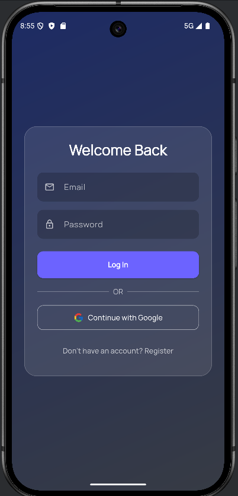
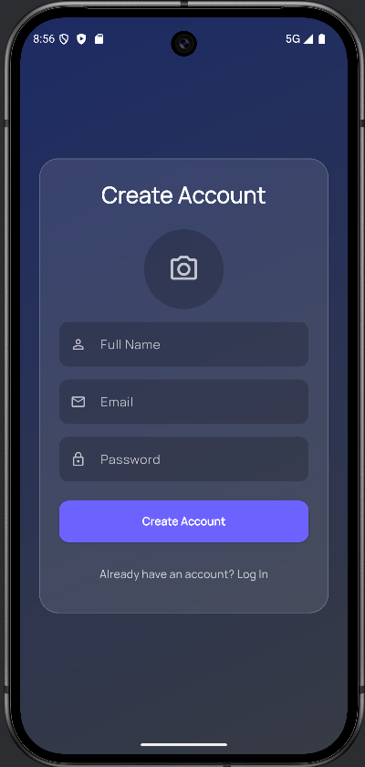
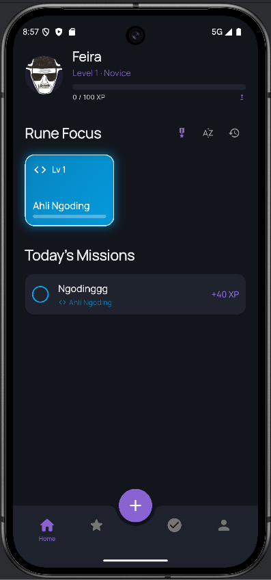
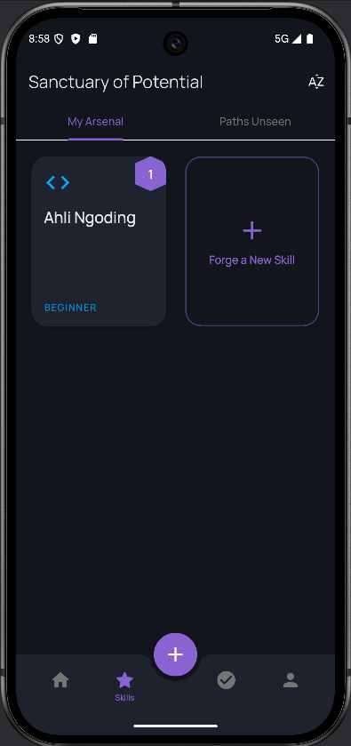
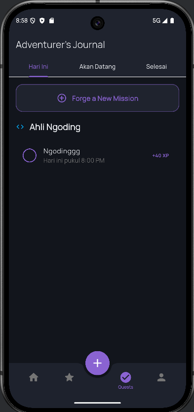
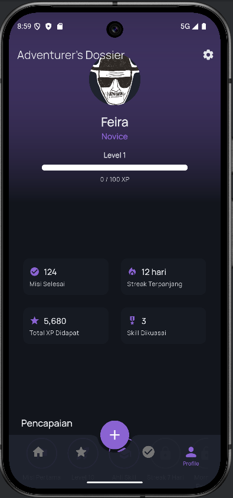
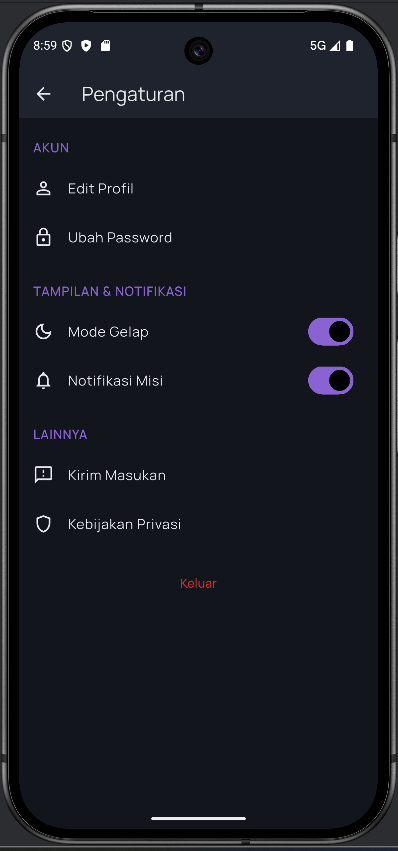

<div align="center">
  
  <h1>HabiVault</h1>
  <p><strong>Level Up Your Life, One Habit at a Time.</strong></p>
  <p>HabiVault adalah sebuah aplikasi "Life RPG" yang mengubah proses pengembangan diri menjadi sebuah petualangan yang imersif dan memuaskan. Lacak kebiasaan, selesaikan misi, dan saksikan karakter Anda di dunia nyata bertumbuh dan naik level.</p>

  <p>
    
    
    
  </p>
</div>

## ✨ Tampilan Aplikasi

<p align="center">
  
  
  
  
  
  
  
</p>

---

## 🚀 Gambaran Proyek

HabiVault lahir dari filosofi **"Atmospheric Minimalism"**. Kami percaya bahwa aplikasi pengembangan diri tidak harus membosankan. HabiVault mengubah tugas-tugas harian menjadi "Misi" dan keahlian yang ingin dikuasai menjadi "Skill". Setiap misi yang selesai akan memberikan XP yang tidak hanya meningkatkan level karakter Anda, tetapi juga level _skill_ yang relevan. Dengan antarmuka yang elegan, penuh animasi, dan nuansa RPG yang kental, HabiVault adalah _command center_ pribadi Anda untuk menjadi versi terbaik dari diri sendiri.

### 🎯 Sustainable Development Goals (SDG) yang Didukung

Proyek ini secara aktif mendukung beberapa tujuan Pembangunan Berkelanjutan dari PBB:

- **SDG 3: Kehidupan Sehat dan Sejahtera (Good Health and Well-being):** Dengan melacak _skill_ seperti "Fitness", "Meditasi", atau "Makan Bergizi", aplikasi ini mendorong pengguna untuk membangun dan mempertahankan gaya hidup yang sehat secara fisik dan mental.
- **SDG 4: Pendidikan Berkualitas (Quality Education):** Pengguna dapat membuat _skill_ untuk belajar hal baru seperti "Belajar Bahasa Jepang", "Membaca Buku Non-fiksi", atau "Menguasai Flutter", menjadikan HabiVault sebagai alat untuk mendukung pembelajaran seumur hidup.
- **SDG 8: Pekerjaan Layak dan Pertumbuhan Ekonomi (Decent Work and Economic Growth):** Fitur pelacakan _skill_ profesional seperti "Public Speaking", "Manajemen Proyek", atau "Desain Grafis" membantu pengguna untuk secara terstruktur meningkatkan keahlian mereka demi pertumbuhan karir yang lebih baik.

## 🛠️ Tumpukan Teknologi (Tech Stack)

| Kategori            | Teknologi                                                |
| :------------------ | :------------------------------------------------------- |
| **Framework**       | Flutter 3.x                                              |
| **Bahasa**          | Dart                                                     |
| **Database**        | Cloud Firestore                                          |
| **Autentikasi**     | Firebase Authentication (Email/Password, Google Sign-In) |
| **Penyimpanan**     | Cloudinary (untuk foto profil pengguna)                  |
| **Manajemen State** | Provider                                                 |
| **Animasi**         | Flutter Animate, Confetti                                |
| **Lainnya**         | Google Fonts, RxDart, Collection, Intl                   |

### 🔥 Penggunaan Firebase

- **Firebase Authentication:** Mengelola seluruh alur registrasi dan login pengguna, termasuk verifikasi email dan integrasi dengan Google Sign-In, untuk memastikan akses yang aman.
- **Cloud Firestore:** Digunakan sebagai database NoSQL _real-time_ untuk menyimpan semua data inti aplikasi, seperti:
  - Profil pengguna (`users`)
  - Daftar keahlian (`skills`)
  - Daftar misi (`missions`)
  - Log progresi XP (`xp_log`)

## ⚙️ Panduan Instalasi & Setup

Untuk menjalankan proyek ini di lingkungan lokal Anda, ikuti langkah-langkah berikut:

1.  **Clone Repositori**

    ```bash
    git clone https://github.com/ariefff666/HabiVault.git
    cd HabiVault
    ```

2.  **Instal Dependensi**
    ```bash
    flutter pub get
    ```
3.  **Konfigurasi Gradle Properties**

    - Buka `android/gradle.properties`
    - Hapus baris `org.gradle.java.home=value` atau ganti dengan direktori Java Home Path milik anda.

4.  **Setup Proyek Firebase**

    - Buat sebuah proyek baru di [Firebase Console](https://console.firebase.google.com/).
    - Tambahkan aplikasi **Android** dan/atau **iOS** ke proyek Anda. Ikuti instruksi untuk menambahkan file konfigurasi (`google-services.json` untuk Android, `GoogleService-Info.plist` untuk iOS) ke dalam proyek Flutter Anda.
    - Di Firebase Console, aktifkan layanan berikut:
      - **Authentication:** Aktifkan _provider_ **Email/Password** dan **Google**.
      - **Firestore Database:** Buat database dalam mode produksi atau tes.
    - Kembali ke IDE atau Editor Kode Anda, buka terminal dan jalankan `cd android` (navigasi ke folder `android`). Kemudian, jalankan `.\gradlew signingReport` atau `./gradlew signingReport`. Ini akan menampilkan SHA1 dan SHA-256 dari keystore Anda.
    - Salin SHA1 dan SHA-256 (masukkan masing-masing) ke `Firebase Console > Overview > Android App (Nama) > Klik Ikon Pengaturan`.
    - Di tab `General`, gulir ke bawah. Klik `Add fingerprint` dan masukkan nilai SHA1 lalu SHA-256.
    - Kembali ke IDE atau Code Editor Anda, buka terminal dan jalankan `firebase login` (ikuti instruksi untuk masuk ke Akun Google Anda [gunakan yang sama dengan Akun Firebase Anda]).
    - Setelah berhasil masuk, jalankan `dart pub global activate flutterfire_cli` lalu `flutterfire configure --project=YOUR-FIREBASE-PROJECT-ID` (konfigurasi hanya untuk Android, gunakan spasi untuk menonaktifkan platform lain). Ini akan menghasilkan dan mengganti `lib/firebase_options.dart`.

5.  **Konfigurasi Environment Variables**

    - Buat file bernama `.env` di direktori utama proyek dengan mengikuti contoh di `.env.example`.
    - Tambahkan semua nilai `FirebaseOptions android` di dalam `lib/firebase_options.dart` ke `.env` untuk bagian yang diawali FIREBASE_ANDROID. Periksa file asli `lib/firebase_options.dart` pada github ini [https://github.com/DSC-UNSRI/Secure-MVC-Flutter-Firebase-Example] (sebelum Anda menggantinya menggunakan `flutterfire configure`) untuk dimodifikasi dan dilanjutkan (jangan simpan API Key ke source control, bruh).
    - Isi sisa file tersebut (bagian Cloudinary) dengan kunci API dari proyek Cloudinary Anda.

      ```env
      # Firebase Keys (dapatkan dari file konfigurasi Firebase)
      FIREBASE_ANDROID_API_KEY=...
      FIREBASE_ANDROID_APP_ID=...
      # ... (dan seterusnya)

      # Cloudinary Keys (dapatkan dari dashboard Cloudinary Anda)
      CLOUDINARY_CLOUD_NAME=...
      CLOUDINARY_API_KEY=...
      CLOUDINARY_UPLOAD_PRESET=...
      ```

    - Jalankan perintah ini untuk mengenkripsi kunci Anda:
      ```bash
      dart run build_runner build --define flutter_secure_dotenv_generator:flutter_secure_dotenv=OUTPUT_FILE=encryption_key.json
      ```
    - Ubah `.vscode/launch.json` `ENCRYPTION_KEY` dan `IV_KEY` berdasarkan file `encryption_key.json` yang dihasilkan (berada folder root).
    - _Catatan: Konfigurasi `launch.json` untuk VS Code mungkin diperlukan jika Anda ingin menjalankan dalam mode debug dengan variabel terenkripsi._

6.  **Jalankan Aplikasi**
    - Gunakan fitur `Run and Debug` (CTRL + SHIFT + D) dan debug aplikasi menggunakan emulator Android favorit Anda atau melalui USB debugging.

## 🚀 Cara Penggunaan & Kontribusi

### Cara Penggunaan

1.  **Buat Akun:** Daftar menggunakan email atau Google.
2.  **Ukir Skill Pertama Anda:** Setelah masuk, Anda akan dipandu untuk membuat _skill_ pertama yang ingin Anda kuasai.
3.  **Tetapkan Misi:** Buat misi-misi harian atau mingguan yang terhubung dengan _skill_ Anda.
4.  **Taklukkan Misi:** Selesaikan misi Anda setiap hari dan tandai sebagai selesai untuk mendapatkan XP.
5.  **Saksikan Progres Anda:** Lihat level karakter dan _skill_ Anda meningkat di _dashboard_ dan halaman "Sanctuary of Potential".

### Panduan Kontribusi

Kami sangat terbuka untuk kontribusi! Jika Anda ingin membantu mengembangkan HabiVault, silakan:

1.  _Fork_ repositori ini.
2.  Buat _branch_ baru (`git checkout -b fitur/NamaFiturAnda`).
3.  Lakukan perubahan dan _commit_ (`git commit -m 'Menambahkan Fitur Keren'`).
4.  _Push_ ke _branch_ Anda (`git push origin fitur/NamaFiturAnda`).
5.  Buka sebuah _Pull Request_.

## 📥 Unduh APK

Anda bisa mengunduh dan mencoba versi rilis dari aplikasi ini melalui tautan di bawah.

- [Unduh APK (arm64-v8a)](https://github.com/ariefff666/HabiVault/releases/download/v.0.0.1/app-arm64-v8a-release.apk)
- [Unduh APK (armeabi-v7a)](https://github.com/ariefff666/HabiVault/releases/download/v.0.0.1/app-armeabi-v7a-release.apk)
- [Unduh APK (x86_64)](https://github.com/ariefff666/HabiVault/releases/download/v.0.0.1/app-x86_64-release.apk)
- [Unduh APK (FAT APK)](https://github.com/ariefff666/HabiVault/releases/download/v.0.0.1/app-release.apk)

---

<div align="center">
  Dibuat dengan ❤️ dan semangat untuk pengembangan diri.
</div>
